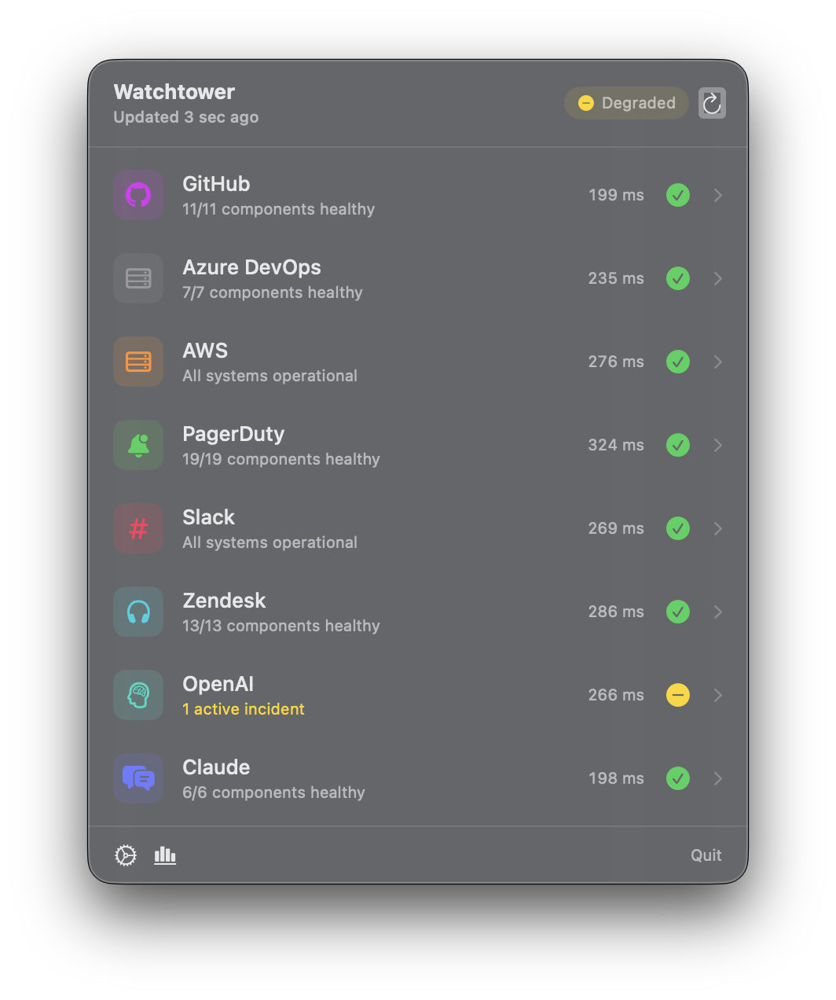
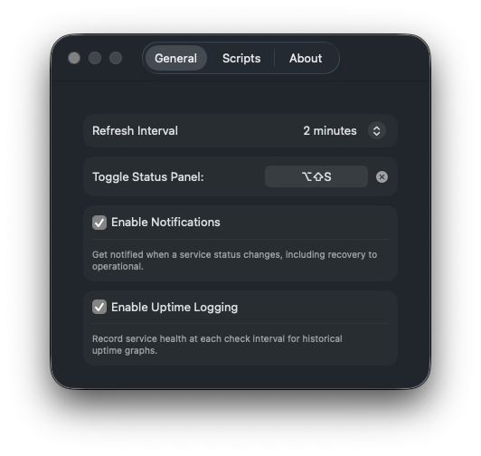
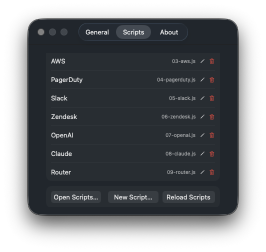
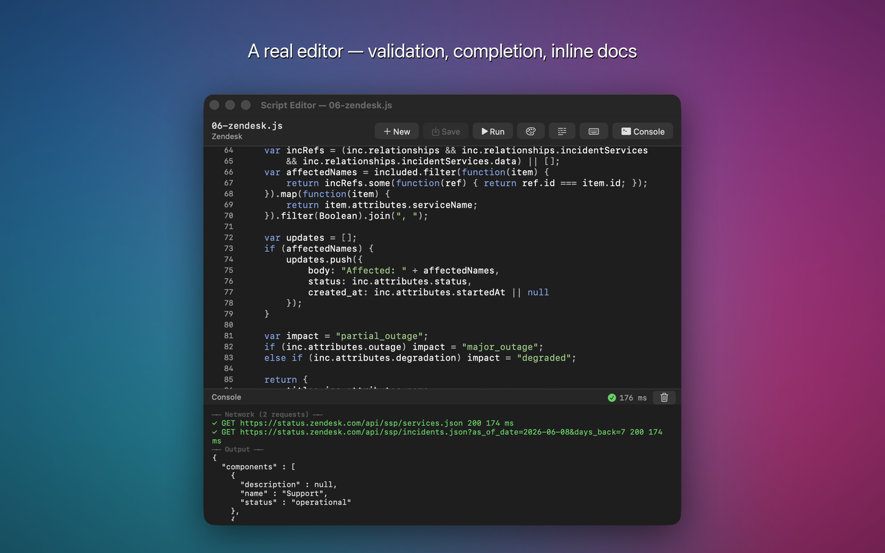
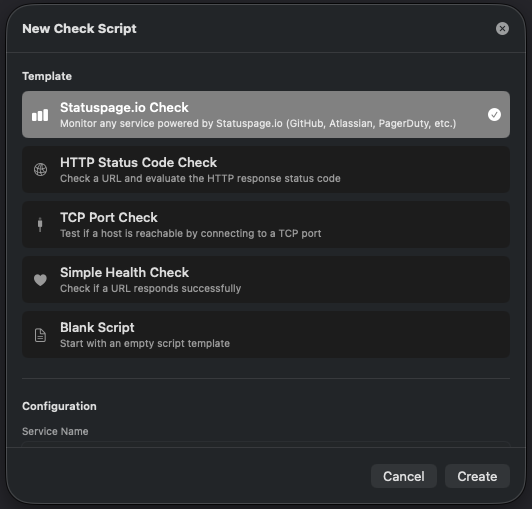
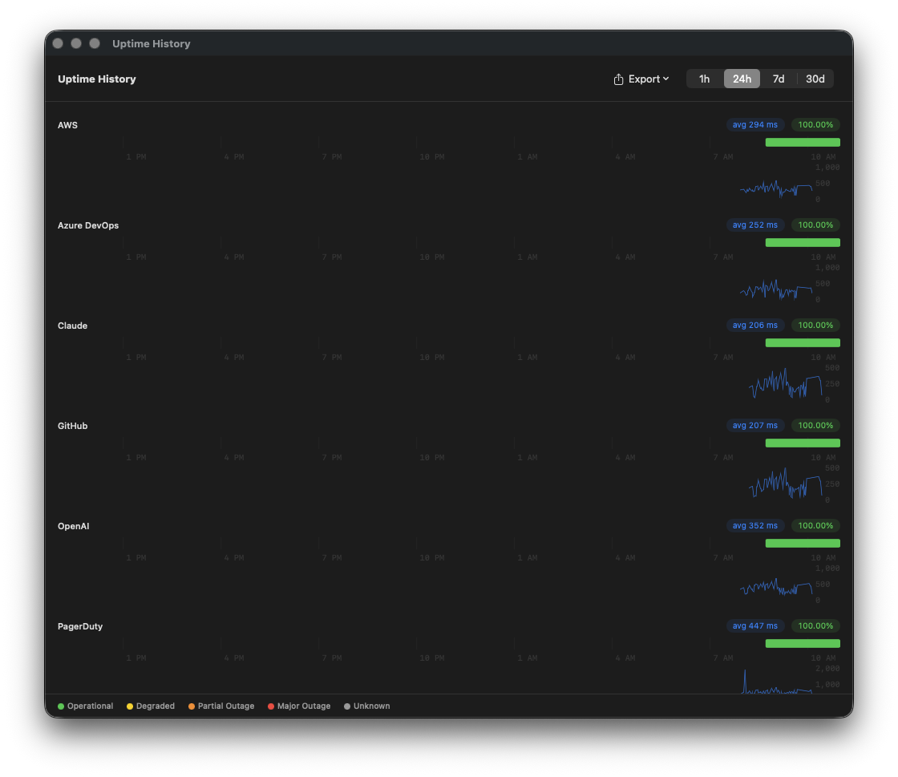

# Outpost Beacon

A macOS menu bar app that monitors the health of key infrastructure services at a glance.

<p align="center">
  
</p>

## Features

- **Menu bar status icon** — changes color and shape to reflect overall service health
- **Status dashboard** — floating panel shows all monitored services with component-level detail
- **Service drill-down** — click any service to see components, active incidents, and recent event history
- **Global keyboard shortcut** — configurable hotkey to toggle the dashboard
- **Background polling** — refreshes service status on a configurable interval, with optional per-script intervals
- **macOS notifications** — opt-in alerts when a service degrades or recovers
- **Response time tracking** — measures and displays service response time
- **Uptime history** — opt-in graphical timeline showing historical uptime and response times per service
- **Uptime report export** — export uptime data as CSV or PDF
- **Custom status checks** — write JavaScript scripts to monitor any service using the built-in API
- **Built-in script editor** — create and debug check scripts with syntax highlighting, templates, and a run console
- **Dark mode support** — adapts to system appearance

<p align="center">
  
  &nbsp;&nbsp;
  
</p>

<p align="center">
  
</p>

<p align="center">
  
  &nbsp;&nbsp;
  
</p>

## Requirements

- macOS 14.0 (Sonoma) or later

## Installation

Outpost Beacon is available on the [Mac App Store](https://apps.apple.com/app/outpost-beacon/id6772313616).

## Custom Status Checks

Outpost Beacon runs JavaScript check scripts using Apple's built-in JavaScriptCore engine — no external runtime required. Scripts live in:

```
~/Library/Application Support/Outpost Beacon/checks/
```

### Available Functions

| Function | Description |
|----------|-------------|
| `fetch(url)` | HTTP GET → parsed JSON object |
| `fetchResponse(url)` | HTTP GET → `{ status, body }` |
| `fetchText(url)` | HTTP GET → raw response string |
| `fetchAll([url1, url2, ...])` | Concurrent HTTP GET → array of parsed JSON |
| `output(obj)` | Set the script's result (required, call once) |
| `statuspageCheck(url)` | One-liner for any Statuspage.io service |
| `tcpCheck(host, port, options?)` | TCP connect check → `{ success, latencyMs, error }` |
| `stripHtml(text)` | Remove HTML tags and decode entities |
| `log(message)` | Debug logging |

### Example: Statuspage.io Service

```javascript
// OUTPOST_NAME = "GitHub"
// OUTPOST_URL = "https://www.githubstatus.com"

statuspageCheck("https://www.githubstatus.com/api/v2/summary.json");
```

### Example: HTTP Health Check

```javascript
// OUTPOST_NAME = "My API"
// OUTPOST_URL = "https://api.example.com"

try {
    fetch("https://api.example.com/health");
    output({ status: "operational" });
} catch (e) {
    output({ status: "major_outage" });
}
```

### Example: TCP Port Check

```javascript
// OUTPOST_NAME = "Database"

var result = tcpCheck("db.example.com", 5432, { timeout: 3 });
output({
    status: result.success ? "operational" : "major_outage",
    responseTimeMs: result.latencyMs
});
```

For more examples and the full scripting reference, see the [Scripting Guide](docs/scripting.md).

## Support

- **Support page** — [Outpost Beacon Support](https://mcherry.github.io/Outpost-Beacon/support.html)
- **Bug reports & feature requests** — [open an issue](https://github.com/mcherry/Outpost-Beacon/issues)
- **Email** — info@inditech.org

## Privacy

Outpost Beacon does not collect, transmit, or share any personal data. See the full [Privacy Policy](https://mcherry.github.io/Outpost-Beacon/privacy.html).

## License

Copyright © 2025 Mike Cherry. All rights reserved.
